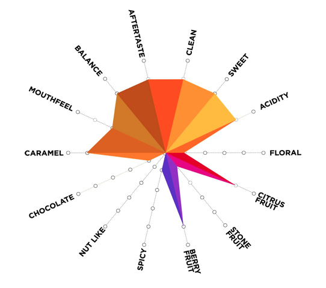

# coffee-spiders

[Artisan Roast](https://www.artisanroast.co.uk), an Edinburgh based coffee roaster, have a really nice way to visualise the taste of their coffees:

When dialling in my espressos I really like having this sort of plot handy so I wrote a quick `matplotlib` script to generate them based on a score and label dictionary:

Pretty close! And all using nice standard `matplotlib` features.
